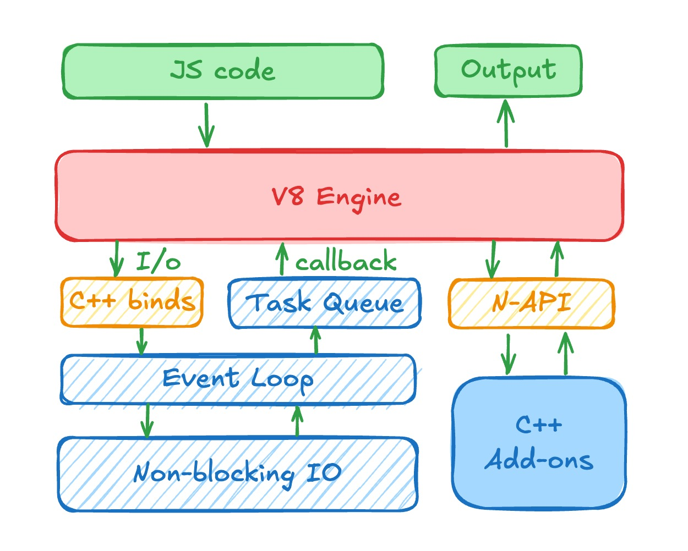

# Learn NodeJS, Combine the Frontend and Backend

## NodeJS
### Where to start?
 - [NodeJS Documentary](https://www.youtube.com/watch?v=LB8KwiiUGy0)

### What is NodeJS?
 - NodeJS is a JS runtime environment
 - NodeJS = V8 + Libuv + C++binds
    - V8 : Google's JS Engine
    - Libuv : Cross-platform library for asynchronous I/O
    - C++binds : Connects V8 and Libuv to the C++
 
 - NPM: Node Package Manager?

## Express
### Where to start?
 - [Express Official Website](https://expressjs.com/en/starter/hello-world.html)
 - Really an easy web framework, nothing special.

## CORS
### What is CORS?
 - CORS = Cross-Origin Resource Sharing
 - CORS is a security feature implemented by web browsers to prevent web pages from making requests to a different domain than the one that served the web page.
### How to support CORS?
```js
app.use(cors({
  origin: 'http://localhost:8888', // Your frontend URL
  credentials: true,
  methods: 'GET,PUT,POST,DELETE,UPDATE,OPTIONS',
  allowedHeaders: 'X-Requested-With, X-HTTP-Method-Override, Content-Type, Accept',
}));
```